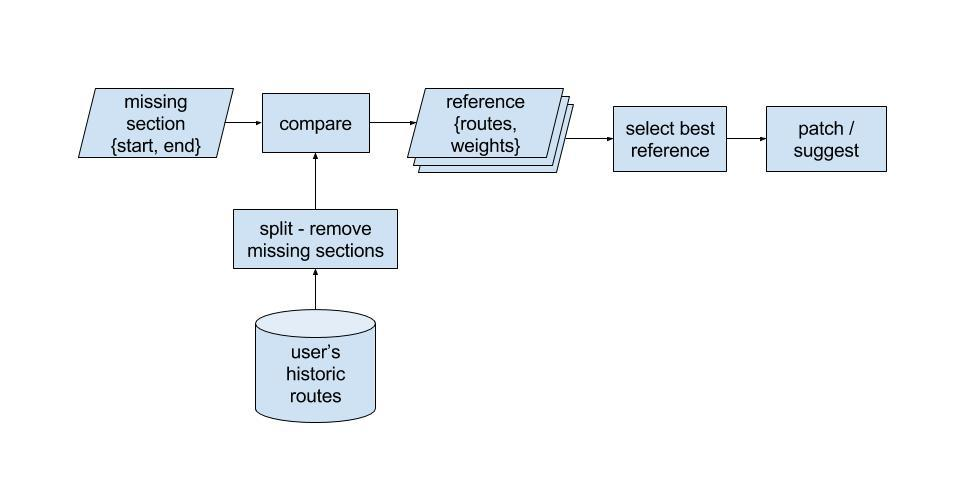
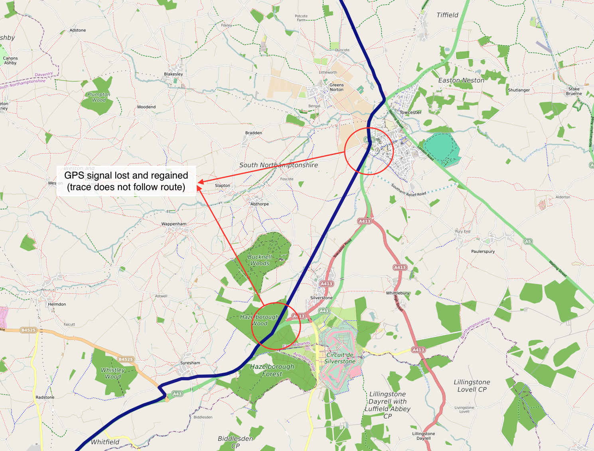
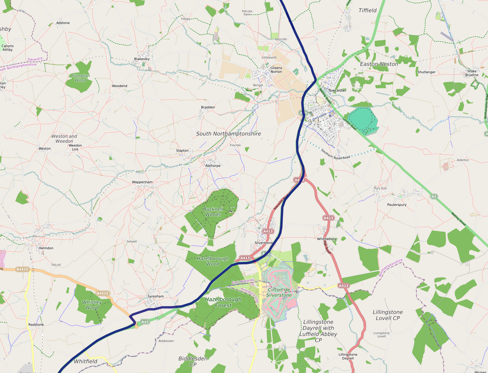

# Patching broken trip information in GPS traces

GPS traces have gaps in transmission. These often occur, but are not confined to the beginning of a trip.

<!-- more -->

They can also occur on highways or tunnels or parking lots. In our traces we have found that breaks in routes of more than a km in length occur in about 5% of the trips. The length of these broken routes could be as large as 10 km. In addition we see completely missing trip ends (a new trip does not start at the location that the previous trip ended). Our objective is to patch the broken routes and missing ends with the most probable actual route.

### Architecture

### Extracting broken sections

Firstly we need to define what constitues a break in a trip which needs patching. This could be as small as 250m for devices that support that level of accuracy. Based on this then broken sections can be identified.

### Obtaining reference routes

The reference routes are obtained from historic trips that the user has made across the broken section. There could be multiple routes which cover the broken section.

Reference route segments are pulled from the historic route data such that:

 * Both the ends of broken section are within a certain distance (20m) of the reference route. This distance of 20m works well for data from our car users. However for more stringent checks (e.g. frequent passings through railway stations, parking lots etc) a more flexible value or repetitive checks with greater radii is probably needed.
 * there is at least one GPS point between the two in the reference route (i.e. the reference route does not have this section missing). 

### Assigning weights to reference routes

The reference routes thus obtained are then reduced into unique sets by comparing them with each other for similarity. Routes are aggregated based on:

 * mean distance between routes being less than 20m
 * Hausdorff distance being less than 100m

The reference sets are assigned weights (size of the set) based on the number of times the user used that particular route historically.
The best candidate reference route is the one with the highest weight.

### An example patch

The original broken trip with the break marked:

The patched trip:

