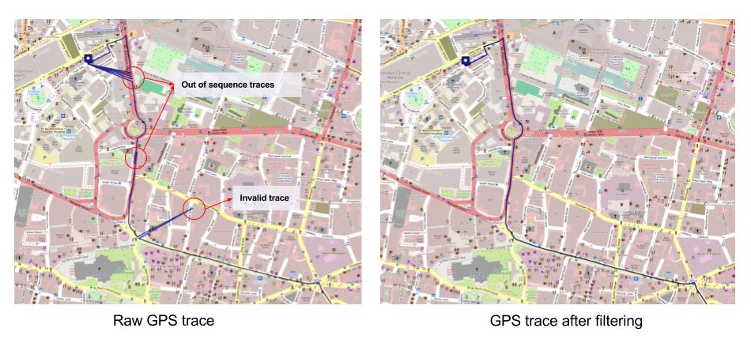
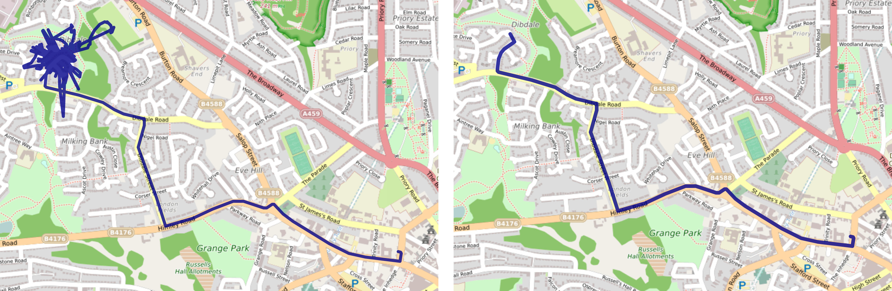

# Cleaning GPS traces for accurate routes and distances

Inaccuracies and errors in GPS data are common and pose a unique challenge to trip and route processing.

<!-- more -->

Unlike most communication technologies which use a terrestrial infrastructure, GPS requires the use of satellites to pinpoint locations. This introduces a unique set of challenges in obtaining a continuous and accurate stream of location traces.

### Invalid GPS traces
There are several factors that contribute to inaccuracies in the GPS data. Impediments between the GPS device and the satellite in the form of tall buildings, tunnels or underground parking lots in urban areas or tall trees in the countryside are the most common causes. The traces in such cases could either be completely missing or could point to a wrong location due to multipath effects. Adverse atmospheric effects could also lead to invalid GPS traces. Most of these inaccuracies are non-systematic and simple signal processing techniques are effective in eliminating them. 

### Low pass filter based on acceleration
Since the invalid GPS traces are random, the distance traversed between the invalid GPS trace and adjacent valid traces is often large for the time duration. Hence the speed of the vehicle required to traverse this distance is very high. A filter on speed alone though effective, does not eliminate all invalid traces according to our findings. What we discover is that since the direction of these traces is also random, the angle incident between the valid and invalid traces is almost always acute. Hence the acceleration required to traverse the path in the specified time intervals are always extremely high compared to valid GPS traces.

Our results suggest that an acceleration based filter is very effective in eliminating almost all invalid GPS traces and at the same time has negligible false negatives - ie genuine GPS traces with acute angles or high speeds as in U-turns and motorways respectively remain untouched.

### Out of sequence traces (Clock Errors)

Clock errors are a very problematic cause of invalid GPS traces. They introduces out of sequence GPS traces resulting in routes that go back and forth between locations and consequently incorrect distance measurements. They also can take the form of small glitches in the traced route. The raw route and the result of passing the route through an acceleration filter are shown below.

A real-life example is this particularly bad GPS trace received from one of our earliest prototypes.

### Static GPS traces
Some GPS devices are programmed to send traces at periodic intervals even when the vehicle is stationary. Sometimes these traces are all over the place because the device is not able to lock-on to a satellite. There incorrect GPS traces can also be filtered out using the acceleration filter.

